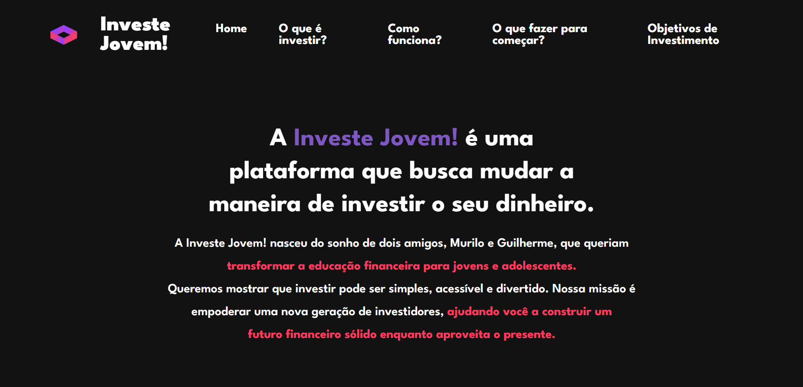
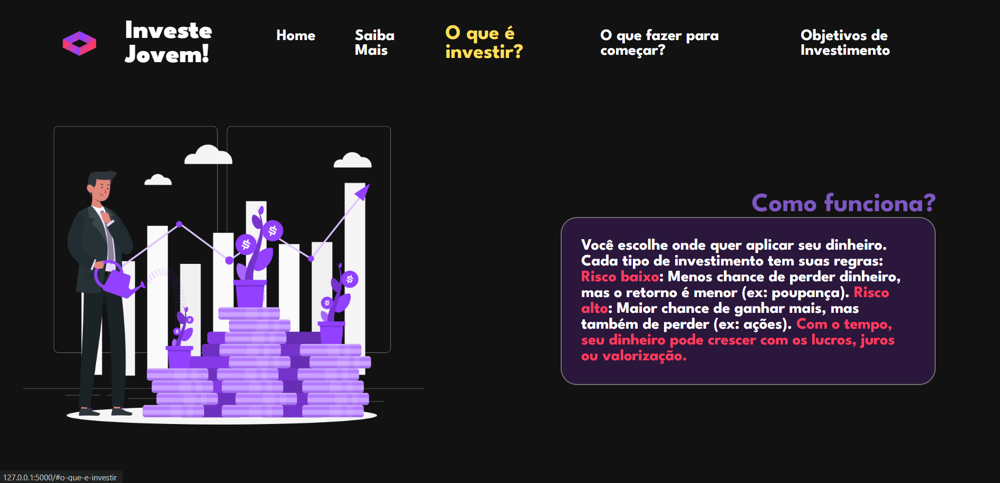
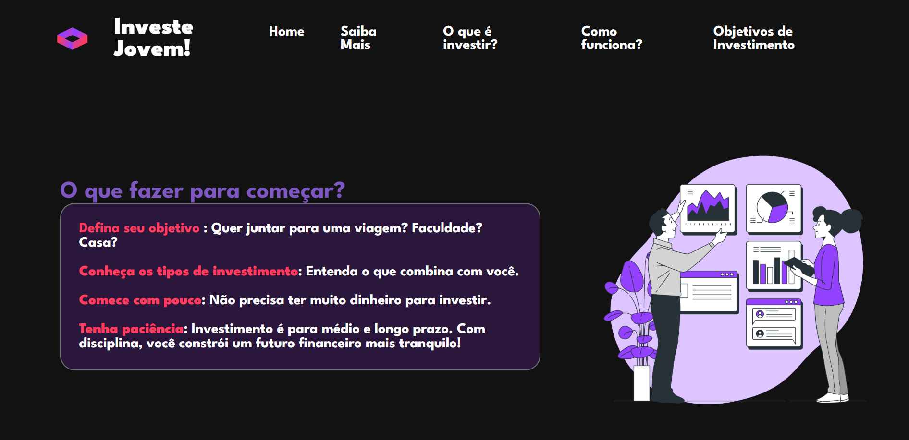
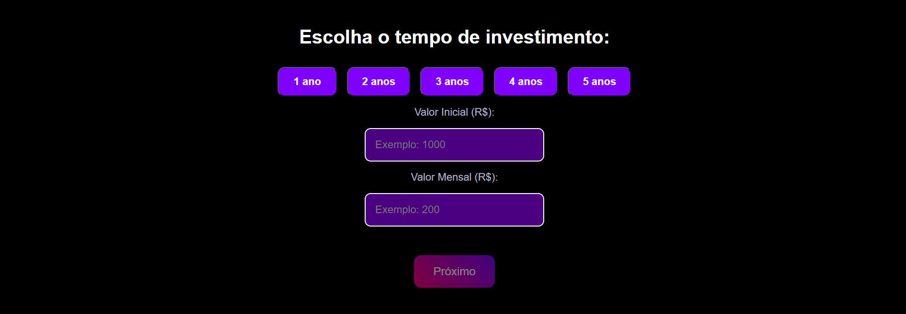
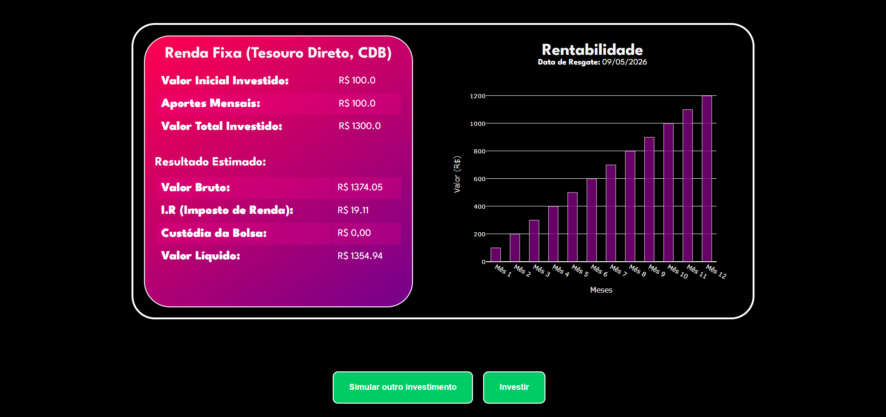

# Investe Jovem

Este projeto é um **simulador de investimentos** interativo, criado para ajudar **jovens que estão saindo da escola** a entender melhor como investir seu dinheiro, **definir metas financeiras** e visualizar o crescimento do seu patrimônio ao longo do tempo.

A plataforma analisa as escolhas do usuário (como **meta financeira** e **prazo em anos**) e **aplica automaticamente o tipo de investimento mais adequado** para alcançar os objetivos definidos. Tudo isso com uma interface simples, responsiva e repleta de gráficos interativos.

---

## 🚀 Tecnologias Utilizadas

- **Frontend**:
  - HTML5
  - CSS3
  - JavaScript

- **Backend**:
  - Python + Flask

- **Gráficos**:
  - Plotly (para visualizações interativas)

---

## 📈 Funcionalidades

- Definição de **meta de investimento** (valor objetivo)
- Escolha do **prazo em anos**
- O sistema **recomenda automaticamente o melhor tipo de investimento** com base na meta e no prazo
- Simulação com valores:
  - Investimento inicial
  - Aportes mensais
- Cálculo com **juros compostos**
- Gráficos interativos para visualização da evolução financeira
- Comparação entre diferentes estratégias
- Interface acessível para jovens iniciantes

---

### 🔹 Tela Inicial

### 🔹 Informações

### 🔹 Objetivo de investimento

### 🔹 Informações do investimento

### 🔹 Resultado Final

---
